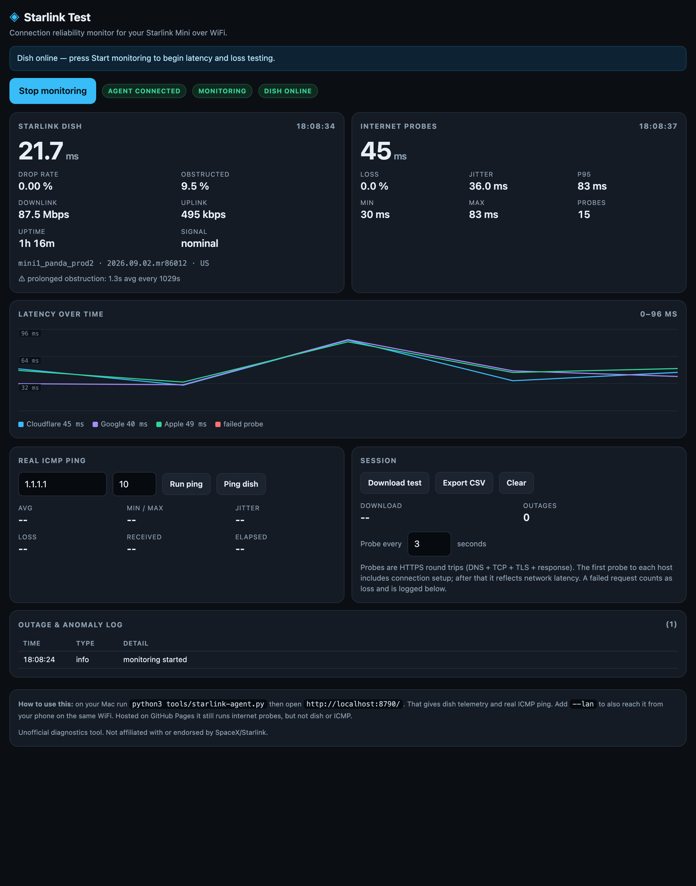

# Starlink Test



A connection reliability monitor for a Starlink Mini on WiFi. Live dish telemetry,
internet latency/jitter/loss probing, real ICMP ping, outage logging, CSV export.

Live: <https://bcorazza.github.io/linkpower-free/starlink/>

## Two modes

| Mode | What you get | How |
| --- | --- | --- |
| **Agent** | Dish telemetry + real ICMP ping + internet probes | `python3 tools/starlink-agent.py` → <http://localhost:8790/> |
| **Browser-only** | Internet probes only | Open the hosted URL from anywhere |

The agent exists because of a hard browser limitation, not by choice:

- A page served over HTTPS **cannot** fetch `http://192.168.100.1:9201` — mixed content.
- Even over HTTP, the dish answers `OPTIONS` with **405**, so no CORS preflight can pass.
- Browsers **cannot send ICMP** at all.

So the agent runs locally, talks to the dish, and serves the UI on `localhost`.

## Running it

```sh
cd /Users/bryancorazza/Downloads/LinkPowerApp
python3 tools/starlink-agent.py            # http://localhost:8790/
python3 tools/starlink-agent.py --lan      # also reachable from your phone on the same WiFi
```

No dependencies — standard library only, any Python 3.9+.

## How the dish API was reverse-engineered

The dish serves its own diagnostics web app at `http://192.168.100.1/`. Its
`Content-Security-Policy` header names the API, and its JavaScript bundle
(`/static/js/script.js.gz`, uncompressed) carries the protobuf field numbers:

```
connect-src http://192.168.100.1:9201/SpaceX.API.Device.Device/Handle
```

That endpoint is **gRPC-Web** (`application/grpc-web+proto`). A request is a framed
protobuf message:

```
[flag=0x00][length uint32 BE][protobuf message]
```

`GetStatus` is field **1004** of `Request`; the reply comes back as field **2004**
(`dish_get_status`). The whole request is three bytes:

```
E2 3E 00        varint tag (1004<<3 | 2) = E2 3E, then length 0
```

Response fields decoded by the agent:

| Field | Meaning |
| --- | --- |
| `1009` | `pop_ping_latency_ms` — the dish's own latency figure |
| `1003` | `pop_ping_drop_rate` — packet drop rate (0 is omitted by protobuf) |
| `1007` / `1008` | downlink / uplink throughput (bps) |
| `1004` | `obstruction_stats` — `fraction_obstructed`, `currently_obstructed`, prolonged-obstruction duration/interval |
| `2.1` | `device_state.uptime_s` |
| `1` | `device_info` — id, hardware (`mini1_panda_prod2`), firmware, country |
| `1016` | `eth_speed_mbps` |
| `1018` / `1022` | SNR above noise floor / persistently low |

`utc_offset_s` is a protobuf **int32**; read as unsigned it wraps to 2^64, so the
agent sign-extends it (yours reads −18000 = US Eastern).

## Caveats

- Internet probes are HTTPS round trips (DNS + TCP + TLS + response). Connections
  are warmed once before the first sample so it isn't dominated by handshake cost,
  but a cold run can still show an outlier.
- Throughput uses Cloudflare's public speed endpoint; a failure there is not
  necessarily a Starlink problem.
- The dish API is undocumented and unversioned. If a field goes blank after a
  firmware update, re-extract field numbers from the dish's own `script.js`.

Unofficial. Not affiliated with or endorsed by SpaceX/Starlink.
